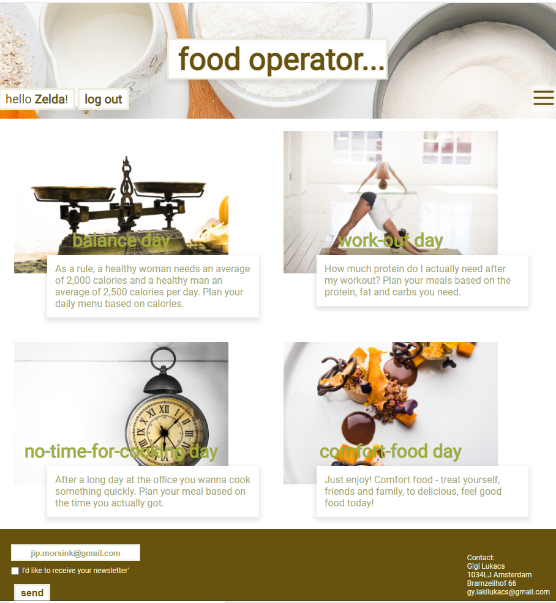
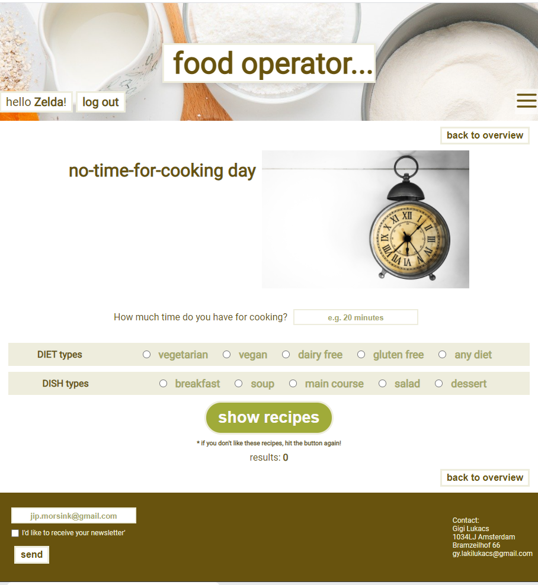

# update! this project was my final project at Hoogeschool Novi and not so representative anymore regarding my most recent en relevant level of experience... 

# food operator...

## Intro

Quick and easy search for recipes adapted to your activities and the dynamics of the day. The user can choose from 4 categories: 
balance day, work-out day, no-time-for-cooking day and comfort-food day:

You can also see how one of the category works:  No-time-for-cooking day.
The user can search for recipes based on the time limit he/she has. Further, it is also possible in every category give preferences for the diet types. 
In this category the dish types as well:

 

Oops, we have only 15 minutes...Let's search for recipes for vegan soups! 

 

## NPM commando's

'npm install react-hook-form'
'npm install react-router-dom'
'npm install axios'
'npm install jwt-decode'
'npm install react-icons'
