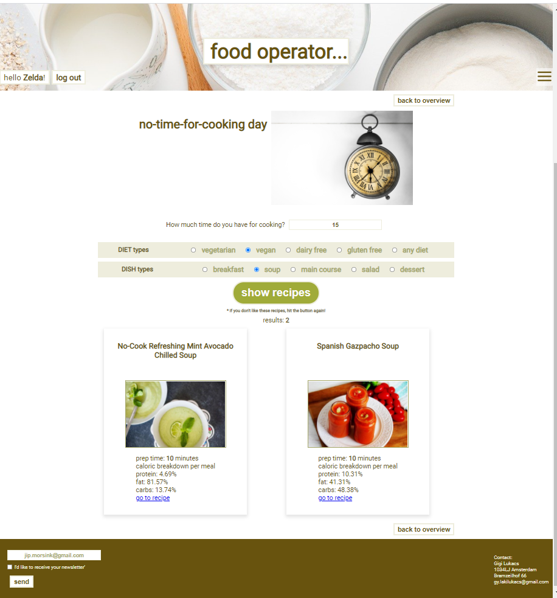

# food operator...

## Intro

Quick and easy search for recipes adapted to your activities and the dynamics of the day. The user can choose from 4 categories: 
balance day, work-out day, no-time-for-cooking day and comfort-food day:

You can also see how one of the category works:  No-time-for-cooking day.
The user can search for recipes based on the time limit he/she has. Further, it is also possible in every category give preferences for the diet types. 
In this category the dish types as well:

 

Oops, we have only 15 minutes...Let's search for recipes for vegan soups! 

 

## Lijst van de benodigdheden om de app te kunnen runnen:

GitHub repository

Email account

API-key
Om deze app te kunnen gebruiken, heb je een API-key nodig.
Deze kun je gemakkelijk verkrijgen door jezelf aan te melden bij Spoonacular.
Doe dat via de volgende link.

3.	Stappenplan
      
Eerst moet je de GitHub repository clonen.
Het project is opgezet met Create React App.
Wanneer je een project van iemand anders opent, draai je altijd eerst een globale installatie:
npm install
Hiermee haal je alle dependencies van het project binnen.
De applicatie kan gestart worden door npm start in de terminal in te voeren en op enter te drukken. De applicatie opent een tab met http://localhost:3000 in uw browser.

## Met welke gegevens er ingelogd kan worden of kan de gebruiker een nieuwe account registreren?

De gebruiker kan registreren en vervolgens inloggen met eigen account. Bij eerste keer registreren kan het zijn dat het 30 seconden duurt voordat  je wordt doorgestuurd naar de sign in pagina. Voor deze applicatie wordt gebruikt gemaakt van de Novi backend.

## Welke andere npm commando’s er nog beschikbaar zijn in deze applicatie?

Forms
Om react-hook-form te kunnen gebruiken moeten we eerst installeren in het project. Typ daarom het volgende in jouw terminal:

'npm install react-hook-form'

Routing
Routing omvat alles dat nodig is om de gebruikers op de juiste pagina, met de juiste content te krijgen.
Je moet in de terminal openen en react-router installeren:

'npm install react-router-dom'

http request maken
Door middel van een specifieke url gegevens kunnen recepten opvragen:  er wordt een GET-request gemaakt naar de Spoonacular API.  
De library  Axios hiervoor is handig om te gebruiken. We kunnen hierdoor de variabele axios gebruiken als basis om de verschillende functies die deze library beschikbaar heeft gesteld, te gebruiken.
Download Axios door het volgende in de terminal te typen:

'npm install axios'

JWT-token
We hebben hier de JWT token nodig om daaruit de userID te halen
 Hier gebruiken we de package jwt-decode voor:

'npm install jwt-decode'

React icons library 
Er wordt gebruik gemaakt van de React icons library, die kan je installeren om de volgende in de terminal te typen:

'npm install react-icons'
